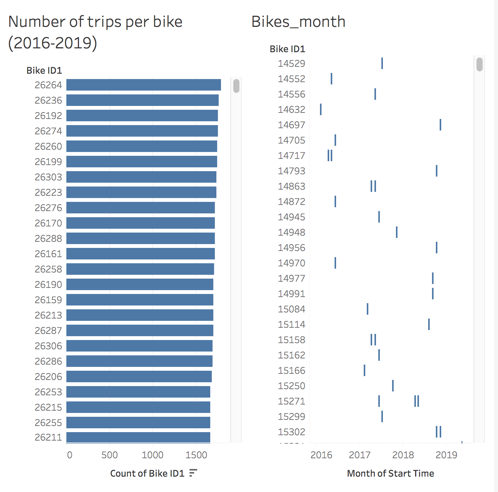

# Citi-Bike-analysis-with-Tableu
The Jupyter notebook gather information of the usage of the citibikes in New York ( https://www.citibikenyc.com/system-data) from 2016-2019. Some features were removed and others added.

The distance was added to the data using the formula found in the citibike page (Milage estimates are calculated using an assumed speed of 7.456 miles per hour, up to two hours. Trips over two hours max-out at 14.9 miles)

The zipcode was added using the library 'uszipcode'.

The age was calculated substracting the year selected - the birth year.

The following link contains the Tableu file with the details of this project. The plots are summarized in several dashboards that are described below.
File link: https://public.tableau.com/profile/maribel.ojeda#!/vizhome/Citi-BikeTableuDashboards/Summer_hrs?publish=yes

# Summary

## Dashboard 1
* How many trips have been recorded total during the chosen period?
* By what percentage has total ridership grown?

## Dashboard 2
* What are the peak hours in which bikes are used during summer months?
* What are the peak hours in which bikes are used during winter months?

## Dashboard 3
* How effective has gender outreach been in increasing female ridership over the timespan?
* How does the average trip duration change by age?
* What is the average distance in miles that a bike is ridden?

## Dashboard 4
* How has the proportion of short-term customers and annual subscribers changed?

## Dashboard 5
* Which bikes (by ID) are most likely due for repair or inspection in the timespan?
* How variable is the utilization by bike ID?

## Dashboard 6
* A static map that plots all bike stations with a visual indication of the most popular locations to start and end a journey with zip code data overlaid on top.
* If you're working with a merged dataset: a dynamic map that shows how each station's popularity changes over time (by month and year) -- with commentary pointing to any interesting events that may be behind these phenomena.

# Missing Questions
Today, what are the top 10 stations in the city for starting a journey? (Based on data, why do you hypothesize these are the top locations?)

Today, what are the top 10 stations in the city for ending a journey? (Based on data, why?)

Today, what are the bottom 10 stations in the city for starting a journey? (Based on data, why?)

Today, what are the bottom 10 stations in the city for ending a journey (Based on data, why?)

Today, what is the gender breakdown of active participants (Male v. Female)?
